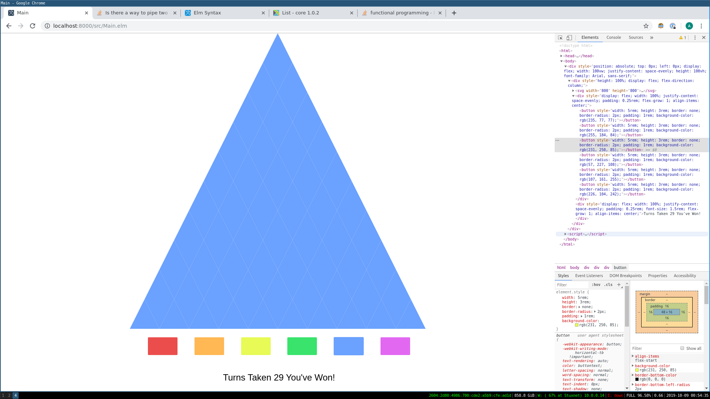

# Rain

A simple variation on flood-it games, built in elm for the browser

This is a WIP

Check out the TODO list below.

# Challenges

## Solved

- Draw tesselated triangle grid as function of rows and grid dimensions
- Generate adjacency graph for grid as function of number of rows
- Color nodes n different colors
- Expanding perimeter graph traversal ('flood')
- Win test and state
- Turn counter

## In Progress
- Sleep
## On Deck

- On load, get time to drive random seed
- New game button
- Game options (row counts, n colors, color schemes)
- View responds to window resize
- Embedding Elm in a web app

## Stretch
- When you hover a node, all adjacent nodes of the same color get highlighted
- Square Grids, Hexagonal Grids
- Train a solver (every project needs AI) 

